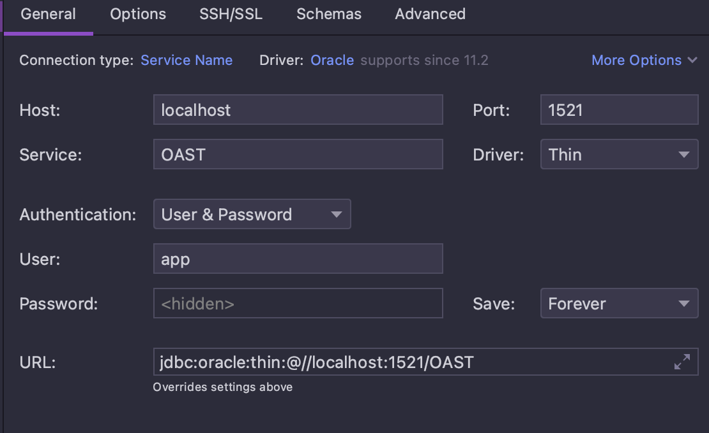

# Spring Boot app with Oracle DB + testcontainers example to run on a machine with Apple Silicon CPU

### Run Oracle-XE in docker container (gvenzl/oracle-xe)
Use instructions from https://github.com/gvenzl/oci-oracle-xe#oracle-xe-on-apple-m-chips
<br>I had no issues, everything works fine.
After instructions above we can create container:
```bash
docker run --name=oracle-experiments -d -p 1521:1521 \
        -e ORACLE_DATABASE=OAST \
        -e APP_USER=app \
        -e APP_USER_PASSWORD=app_pass \
        -e ORACLE_PASSWORD=passnoq gvenzl/oracle-xe:21.3.0-slim-faststart
```
Example of connection to container


## Testcontainers
Set environment variables as described below (source [source article](https://blog.jdriven.com/2022/07/running-oracle-xe-with-testcontainers-on-apple-silicon/)).
Set TestContainers env vars, you may add these to your Bash Profile (~/.bash_profile) or ZShell profile (~/.zshrc) or any other profile you like.
```bash 
export TESTCONTAINERS_DOCKER_SOCKET_OVERRIDE=/var/run/docker.sock
export DOCKER_HOST="unix://${HOME}/.colima/docker.sock"
```
Also you may set env variables in JUnit config (IDEA -> Edit configurations).
Unfortunately, for time being it takes about 2 minutes to start testcontainer with Oracle-XE. Currently have no idea to 
decrease container startup time.
